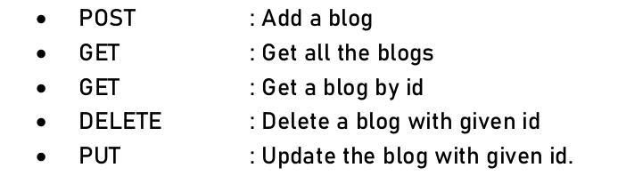

# Posts & Comments Thread Engine
[Postman collection link](https://www.getpostman.com/collections/048bfbaeeb7ade0f78aa)

[Schema modelling reference](https://nehajirafe.medium.com/data-modeling-designing-facebook-style-comments-with-sql-4cf9e81eb164): 
I have used H2, a SQL database, for this project. I used Closure table *ParentChildComment* to store relationships between comments and their replies.

## List of APIs 
\

